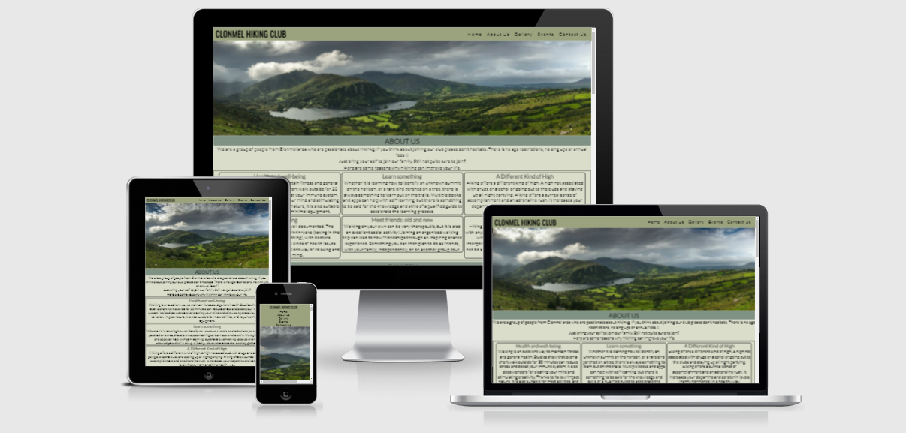
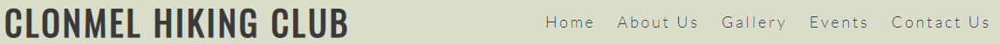
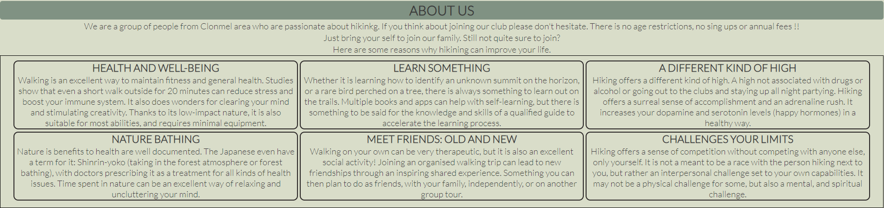
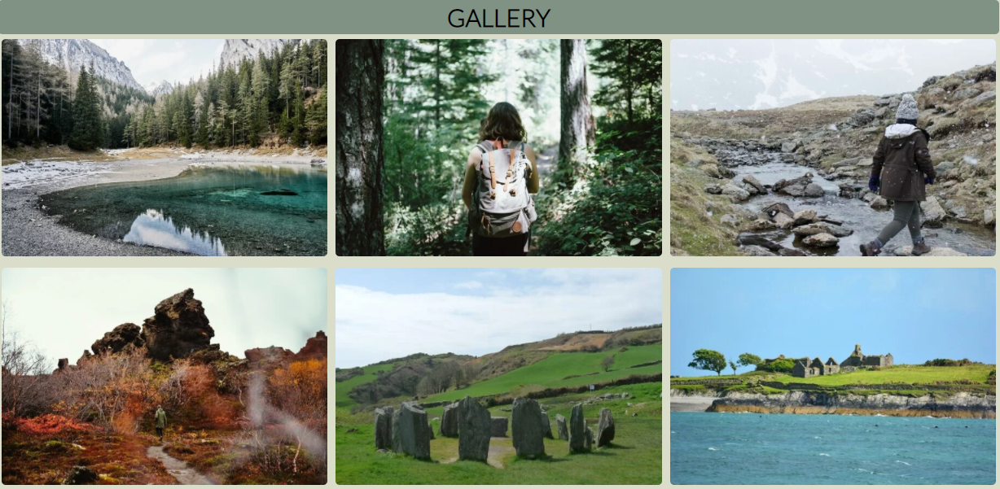
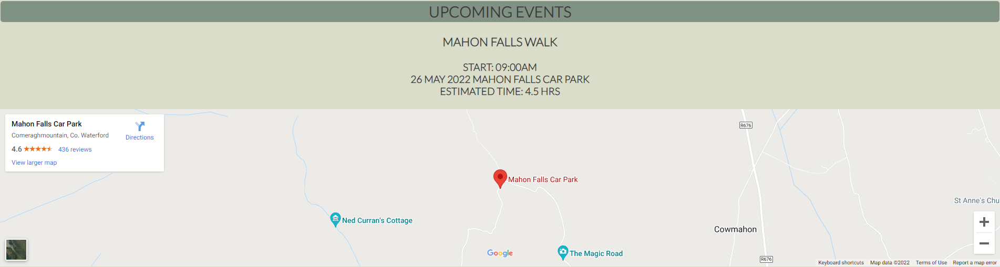
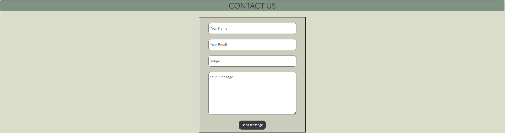
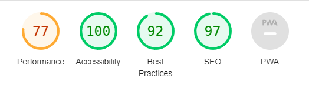

# **Clonmel Hiking Club**
**[Click here to visit Clonmel Hiking Club website](https://kwalczak80.github.io/Clonmel-Hiking-Club)** 

Welcome to the official Clonmel Hiking Club website.
  The website is designed to provide information about hiking club in Clonmel area. Website consists of sections where visitors can find relevant infomation about the club, check the new pictures in the gallery, find out about upcoming events and to contact the club if thay have any queries.

  

# **User Experience (UX)**
<ul>
<li><h3>User Stories</h3></li>
  <ul><li><strong>First-time Visitor Goals</strong>
<ul>
    <li>As a first-time visitor, I would like to easily understand what the website is about and easely navigate throughout its content,</li>
<li>As a first-time visitor, I would like read information about the Clonmel Hiking Club and find other interesting information I'm looking for.
</ul>
</ul>

<ul><li><strong>Returning Visitor Goals</strong>
<ul>
    <li>As a returning visitor, i would like to find more information about the club in social media channels,</li>
  <li>As a returning visitor, i want to find/use a contact form page.</li>
  </ul>
</ul>
<ul><li><strong>Frequent User Goals</strong>
<ul>
    <li>As a frequent user, I want to check if the gallery has been updated with new photos that might inspire for hiking trips,</li>
  <li>As a frequent user, I want to find information about upcoming events that might be suitable for me,</li>
  <li>As a frequent user, I want to use contact form to get more information about the topic I'm interested about.</li>
  </ul>
</ul>  
</ul>
</ul>
</ul>

# **Design**
<ul>
<li><strong>Colour Scheme</strong></li>
<ul>
<li>The colors used on the website are to be in line with the theme of hiking in the mountains. The appropriate shade of colors on the page ensures that there are no large contrasts between the individual sections of the page.</li>

<ul>
<li>#9BA37E is the main background color for the menu section,</li>
<li>#D9DDC9 is the main background color for the body of the website,</li>
<li>#000000 is the main color for all text information displayed on the webpage.</li>
</ul>
</ul>
<ul>
<li><strong>Typography</strong></li>
<ul>
<li>The Lato font is the main font used in this project with Oswald as the second font used for club name. Both fonts were imported from Google fonts website.</li> 
</ul>
</ul>
<ul>
<li><strong>Images</strong></li>
<ul>
<li>The photos in the gallery section are very important part of this website as they allow users to view photos uploaded by other users which can be an inspiration for hiking trips for other people.</li>
</ul>
</ul> 
<ul>
  <li><strong>Information grouping</strong></li>
<ul>
<li>Grouping text information and images on the website is to ensure the most comfortable use by visitors. When viewing this website on large screens, text information is grouped into three columns. The images from the gallery section are automatically scaled to allow the appropriate view on the screen. For smaller screens, text information is displayed in a single column, similar to photos</li>
  </ul>
  </ul>
  
# **Features**
<ul>
  <li><strong>Navigation</strong></li>
<ul>
<li>
The navigation menu is located at the top of the page. The page navigation system consists of club name which is located on the left hand side while the other navigation links are located on the right hand side,</li>
<li>
Please note that this navigation layout differ (website navigation links) depending on which screen size the website is displayed,</li>
<li>
The navigation bar is very intuitive and easy to use 
</li>
<li>
The navigation bar is at the top of the page at all times to allow visitors to quickly switch between sections of the page 
</li>
</ul>
</ul>

<ul>
  <li><strong>About Us</strong></li>
<ul>
<li>
  The About-Us section contains a basic information about the club,
</li>
<li>
Additionally, this section contains information intended to encourage other people to start their adventure with hiking.
</li>
</ul>
</ul>

<ul>
  <li><strong>Gallery</strong></li>
<ul>
<li>
 The content of this section is showing photos taken by the club members from their hiking trips,
</li>
<li>
This section can be very inspiring for both new and existing club members.
</li>
</ul>
</ul>

<ul>
  <li><strong>Upcoming events</strong></li>
<ul>
<li>
 The content of this section allows club members or just visitors to find information about upcoming hiking trips,
</li>
<li>
Information in this section is uploaded in advance to make sure that people can plan their hiking trip accordingly,
</li>
<li>
Interactive map allows users to check where the hikng hiking trip will start.
</li>
</ul>
</ul>

<ul>
  <li><strong>Contact Us</strong></li>
<ul>
<li>
 This section allows users to send a message with their queries,
</li>
<li>
Relevant information must be provided in order to sent message i.e. All sections of the form must be fill in order to send message.
</li>
</ul>
</ul>

<ul>
  <li>Responsive design</li>
  <ul>
<li>This website is designed to be reponsive on all devices sizes</li>
<li>Additionally contains interactive elements</li>
  </ul>
</ul>

# **Testing**
<ul>
<li>
The website was tested using the browsers listed below and it's confirmed to work correctly on each one of them:
<ul>
<li>
  Chrome
</li>
<li>
  Firefox
</li>
<li>
  Safari
</li>
<li>
  Edge
</li>
</ul>
</li>
<li>
The website was also viewed on a variety of different devices such as Desktop, Laptop, iPhone 7, iPhone 8, iPhone X, iPhone 12, Google Pixel 4
</li>
<li>
It is confirmed that the website is fully operational and it's design allows users for easy navigation. 
</li>
<li>
It is confirmed that all sections are all readable and easy to understand.  
</li>
</ul>

# **Languages Used**

The following languages have been used during design process:

<ul>
<li><a href="https://en.wikipedia.org/wiki/HTML5">HTML</a></li>
<li><a href="https://en.wikipedia.org/wiki/Cascading_Style_Sheets">CSS</a></li>
</ul>

# **Frameworks, Libraries & Programs Used**
<ol type="1">
<li><a href="https://fonts.google.com/">Google Fonts</a></li>
<ul>
<li>Official Google Fonts website was used to import relevant fonts which are used in the project</li>
</ul>
<li><a href="https://fontawesome.com/">Font Awesome</a></li>
<ul>
<li>Font Awesome was used to add icons which represents links to social media</li>
</ul>
<li><a href="https://github.com/">GitHub</a></li>
<ul>
<li>GitHub was used to store all the project files.</li>
</ul>
<li><a href="https://picresize.com/">The Internet's Original Picture Resizing Tool</a></li>
<ul>
<li>Picture Online Resizing Tool was used to resize relevant images which are displayed in gallery section</li>
</ul>
<li><a href="https://convert-dpi.com/">Online DPI Converter</a></li>
<ul>
<li>Online DPI Converter was used to change DPI ratio of the images downloaded from Pexels website</li>
</ul>
<li><a href="https://ezgif.com/jpg-to-webp">Online JPG to WEBP Converter</a></li>
<ul>
<li>Online JPG to WEBP Converter was used to change images type from JPG to WEBP</li>
</ul>
</ol>

# **Validator Testing**
<ul>
<li>HTML - No errors were found during the code validation process when using the official W3C Validator.</li>
<li>CSS - No errors were found during the code validation process when using the official (Jigsaw) Validator.</li>
</ul>
  
  

# **Bugs**
### **Solved Bugs**
<ul>
<li>
When project was deployed to Github I noticed that images in gallery section were not displayed correctly. To fix the issue I went to GitPod application and I right clicked on each picture to obtain a copy of relative path. Once the code was updated and pushed to Github this problem was no longer an issue.
</li>
<li>
During the Lighthouse testing I discovered that the website performance result was quite low(69%). This was related to size of the pictures(static) displayed in the gallery section. In order to improve the website overall performance the following steps were performed:
<ul>
<li>Size all pictures was reduced to 600x400px,</li>
<li>DPI was reduced from 300 to 72,</li>
<li>All pictures were converted from JPG to WEBP using WEBP Converter</li>
</ul>

</ul>

  
# **Media**
<ul>
<li> 
All the images that are used on the Clonmel Hiking Club website were downloaded from <a href="https://www.pexels.com/">Pexels.com</a></li></ul>

# **Content**
<ul>
<li>The text information in About Us section was copied from the following websites:
</li>
  <ul>
    <li><a href="https://www.tracks-and-trails.com/blog/10-reasons-to-go-hiking-this-summer">Track and Trails</a></li>
  </ul>
 <ul>
  <li><a href="https://blog.tentree.com/10-reasons-you-should-take-a-hike/">The Environmentor</a></li>
  </ul>
 
</ul>

  
# **Deployment**
### **GitHub Pages**

The project was deployed to GitHub pages using the following steps...

<ol type="1">
<li>Log in to GitHub</li>
<li>On the left hand side, click the Clonmel Hiking Club project</li>
<li>At the top of page locate the <strong>Settings</strong> button in the menu section</li>
<li>Scroll down to find out <strong>GitHub Pages</strong> section and the click on "Check it out here!"</li>
<li>Under <strong>Source</strong>, select <strong>Main</strong> from dropdown branch menu</li>
<li>Click <strong>Save</strong> and the page will refresh automatically.</li>
<li>Scroll back down through the page to locate published site <a href="https://kwalczak80.github.io/Clonmel-Hiking-Club/">link</a> in the "GitHub Pages" section.</li></ol>

# **Acknowledgements**
<ul>
<li>My Mentor Simen Daehlin for continuous helpful feedback.</li>
<li>Code Institute's Slack community for their support.</li>
</ul>
