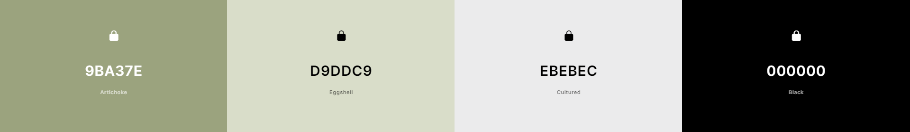
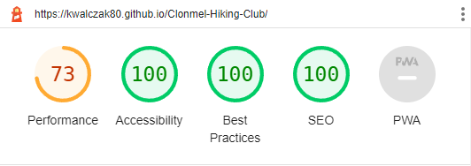

# **Clonmel Hiking Club**
**[Click here to visit Clonmel Hiking Club website](https://kwalczak80.github.io/Clonmel-Hiking-Club)** 

Welcome to the official Clonmel Hiking Club website.
  The website is designed to provide information about hiking club in Clonmel area. The website consists of sections where users can find relevant infomation about the club, view the pictures in the gallery section and find information about upcoming events. In addition, if the user has any queries, they can use a simple contact form in order to send a message to the club.

# **User Experience (UX)**

<h2>User Goals</h2>
<ul><li><strong>First-time User Goals</strong>
  <ul>
  <li>The website has to be easy to and intuitive to use.</li>
  <li>The website has to work well on mobile phones, ipads, tables and desktops.</li>
  <li>The website is visually attractive.</li>
  <li>As the website is displayed on a single page all sections are clearly visually separated.</li>
  </ul>
  </ul>
<h2>User Stories</h2>
  <ul><li><strong>First-time User Goals</strong>
  <ul>
  <li>As a first-time user I would like to easily understand what the website is about.</li>
  <li>As a first-time user I would like to easily navigate throughout the website content.</li>
  <li>As a first-time user I would like to read information about the Clonmel Hiking Club.</li>
  <li>As a first-time user I would like to easily read the information displayed on the webpage regardless of the device screen size I'm using.</li>
  <li>As a first-time user I would like to find other interesting information I'm looking for.</li>
</ul>
</ul>

<ul><li><strong>Returning User Goals</strong>
<ul>
  <li>As a returning user I would like to find more information about the club in social media channels.</li>
  <li>As a returning user I would like to be able to use the contact form to send a message regarding my inquiries.</li>
  </ul>
</ul>
<ul><li><strong>Frequent User Goals</strong>
<ul>
  <li>As a frequent user I would like to check if the gallery has been updated with new photos that might inspire me for hiking trips.</li>
  <li>As a frequent user I would like to find information about upcoming events that might be suitable for me.</li>
 </ul>
</ul>  
</ul>
</ul>
</ul>
<h2>Site owners Goals</h2>
<ul>
  <li>Have a visually appealing website dedicated to hiking trips for people from Clonmel and the surrounding area.</li>
  <li>Have a website  with simple navigation, thanks to which the user will be able to easily find the information they are interested about.</li>
  <li>Have an up-to-date information in the gallery and upcoming events sections so the users can find information about the club's ongoing activities.</li>
</ul>
<h2>User Requirements and Expectations</h2>
<ul>
<li>Requirements</li>
<ul>
<li>Easy to navigate through the website by using links in the menu.</li>
<li>Visually appealing website with a functional structure.</li>
<li>Ability to contact the club with any enquiries.</li>
</ul>
<li>Expectations</li>
<ul>
  <li>To have a nicely designed web layout that can be seen on different screen sizes.</li>
  <li>It should be easy to contact the club by using a simple contact form.</li>
  <li>To receive a message from the club in a timely manner after using contact form.</li>
  <li>To have a content of the website updated regularly i.e., Gallery, Upcoming Events.</li>
  </ul>
</ul>

# **Wireframe**
<ul>
  <li>I used Balsamiq software to create a visual layout of the Clonmel Hiking Club webpage. You can find my wireframes below.</li>
  <ul>
  <li>Desktop wireframe can be found <a href="assets/wireframe/clonmel-hiking-club-wireframe-desktop.pdf">here</a></li>
  <li>Tablet wireframe can be found <a href="assets/wireframe/clonmel-hiking-club-wireframe-tablet.pdf">here</a></li>
  <li>Mobile wireframe can be found <a href="assets/wireframe/clonmel-hiking-club-wireframe-mobile.pdf">here</a></li>
  </ul>
</ul>

# **Design**
<ul>
<li><strong>Colour Scheme</strong></li>
<ul>
  <li>The colors used on the website are to be in line with the theme of hiking in the mountains. The appropriate shade of colors on the page ensures that there are no large contrasts between the individual sections of the page.</li>
  <li>I have used <a href="https://coolors.co">Coolors</a> to come up with a color scheme. I used a contrast checker in order to make sure that the contrast is sufficient and there is no issues with website  readability.</li>

<ul>
  <li>#9BA37E is the main background color for the menu section.</li>
  <li>#D9DDC9 is the main background color for the body of the website.</li>
  <li>#EBEBEC is the main backgroung color for the contact form input fields.</li>
  <li>#000000 is the main color for all text information displayed on the webpage.</li>
</ul>
</ul>
<ul>
<li><strong>Typography</strong></li>
<ul>
  <li>I vistied <a href="https://fonts.google.com/">Google fonts </a> website to explore available font options for my project. After consideration I selected two font types as appropirate.</li>
  <li>I decided to use <a href="https://fonts.google.com/?query=Lato">Lato</a> font as the main font in this project with <a href="https://fonts.google.com/?query=oswald">Oswald</a> as the second font used for the club name. Both fonts were imported from Google fonts website.</li> 
</ul>
</ul>
<ul>
<li><strong>Images</strong></li>
<ul>
<li>The photos in the gallery section are a very important part of this website as they allow users to view photos of other users' hiking tours. This can be very inspiring for other users to plan some interesting hiking trips.</li>
</ul>
</ul> 
<ul>
  <li><strong>Information grouping</strong></li>
<ul>
<li>Appropirate grouping of text information and images is to ensure the most convinient use of the website. When viewing this website on large screens, the text information is grouped into three columns and two rows. The images in the gallery section are automatically scaled to allow appropriate view on the screen. For smaller screens, the text information is displayed in a single column, similar to photos.</li>
</ul>
</ul>
</ul>

  
# **Features**
<ul>
  <li><strong>Navigation</strong></li>
<ul>
<li>The navigation menu is located at the top of the page. The page navigation system consists of the club name which is located on the left hand side while the other navigation links are located on the right hand side.</li>
<li>The navigation bar is very intuitive and easy to use.</li>
<li>The Navigation bar is positioned on top of the page(sticky) at all the time to allow user quickly move between individual sections of the page.</li>
<li>The navigation menu layout differ (website navigation links) depending on which screen size the website is displayed.</li>
<li>A hover effect is implemented to visually highlight menu links when the user hovers over them.</li> 
<li>Once the relevant menu link is clicked by the user the website will automatically scroll up or scroll down in order to display selected section.</li>
</ul>
</ul>

<ul>
  <li><strong>About Us</strong></li>
<ul>
<li>The About-Us section contains a basic information about the club.</li>
<li>Additionally this section contains information intended to encourage other people to start their adventure with hiking.</li>
</ul>
</ul>

<ul>
  <li><strong>Gallery</strong></li>
<ul>
<li>The content of this section is showing the photos taken by the club members from their hiking trips.</li>
<li>This section can be very inspiring for both new and existing club members.</li>
</ul>
</ul>

<ul>
  <li><strong>Upcoming events</strong></li>
<ul>
  <li>The content of this section allows users to find information about upcoming hiking trips,</li>
  <li>Information in this section is uploaded in advance to make sure that people can plan their hiking trips accordingly.</li>
  <li>Interactive map allows users to check where the hikng hiking trip will start.</li>
  <li>User can use the contact form to contact the club in order to get more information about the event.</li>
</ul>
</ul>

<ul>
  <li><strong>Contact Us</strong></li>
<ul>
<li>This section allows user to send a message with their queries,</li>
<li>Relevant information must be provided in order to send a message i.e., all sections of the form must be filled with appropirate information.</li>
</ul>
</ul>

<ul>
<li><strong>Form Confirmation</strong></li>
<ul>
<li>Once the user clicks on a <strong>Send message</strong> button a confirmation page will open(in the same window) informing that their message was received.</li>
<li>The <strong>Home Page</strong> button provides a direct link back to the main page.
</ul>
</ul>

<ul>
<li><strong>Social Media section</strong></li>
<ul>
<li>This section allows user to open the club social media channels.</li>
<li>There are four different social media platforms that users can chose from.</li>
<li>On social media channels users can find even more information about the club, events, etc.</li>
</ul>
</ul>

# **Responsive design**
<ul>
  <li>Responsive design</li>
  <ul>
<li>This website is designed to be reponsive on all devices sizes.</li>
<li>Additionally contains interactive elements.</li>
  </ul>
</ul>

# **Languages Used**

The following languages have been used during the website design process:

<ul>
<li><a href="https://en.wikipedia.org/wiki/HTML5">HTML</a></li>
<li><a href="https://en.wikipedia.org/wiki/Cascading_Style_Sheets">CSS</a></li>
</ul>

# **Frameworks, Libraries & Programs Used**
<ol type="1">
<li><a href="https://fonts.google.com/">Google Fonts</a></li>
<ul>
<li>Official Google Fonts website was used to import relevant fonts which are used in the project</li>
</ul>
<li><a href="https://fontawesome.com/">Font Awesome</a></li>
<ul>
<li>Font Awesome was used to add icons which represents links to social media</li>
</ul>
<li><a href="https://github.com/">GitHub</a></li>
<ul>
<li>GitHub was used to store all the project files.</li>
</ul>
<li><a href="https://picresize.com/">The Internet's Original Picture Resizing Tool</a></li>
<ul>
<li>Picture Online Resizing Tool was used to resize relevant images which are displayed in gallery section</li>
</ul>
<li><a href="https://convert-dpi.com/">Online DPI Converter</a></li>
<ul>
<li>An online DPI Converter was used to change DPI ratio of the images downloaded from Pexels website</li>
</ul>
<li><a href="https://ezgif.com/jpg-to-webp">Online JPG to WEBP Converter</a></li>
<ul>
<li>Online JPG to WEBP Converter was used to change images type from JPG to WEBP</li>
</ul>
<li><a href="https://coolors.co">The super fast color palettes generator</a></li>
<ul>
<li>An online tool was used to determine the appropriate color scheme for the website</li>
</ul>
<li><a href="https://balsamiq.com">UI Design</a></li>
<ul>
<li>Balsamiq software was used to create a visual draft the Clonmel Hinikg Club webpage. Three separated wireframes were created for desktop, tablet and mobile screens.</li>
</ul>
<li><a href="https://chrome.google.com/webstore/detail/unicorn-revealer/lmlkphhdlngaicolpmaakfmhplagoaln?hl=en-GB">Unicorn Revealer</a></li>
<ul>
<li>Extremly helpful tool that helped me to find out where overflows were located on my website.</li>
</ul>
</ol>

# **Testing**
<ul>
<li>
The website was tested using the browsers listed below and it's confirmed to work correctly on each one of them:
<ul>
<li>
  Chrome
</li>
<li>
  Firefox
</li>
<li>
  Safari
</li>
<li>
  Edge
</li>
</ul>
</li>
<li>
The website was also viewed on a variety of different devices such as Desktop, Laptop, iPad, Tablet, iPhone 7, iPhone 8, iPhone X, iPhone 12, Google Pixel 4a.
</li>
<li>
It is confirmed that the website is fully operational and it's design allows users for easy navigation. 
</li>
<li>
It is confirmed that all sections are all readable and easy to understand.  
</li>
</ul>

# **Validator Testing**
<ul>
<li>HTML - No errors or warnings were found during the code validation process when using the official W3C Validator.</li>
<li>CSS - No errors or warnings were found during the code validation process when using the official (Jigsaw) Validator.</li>
<li>The Lighthouse tool was used to assess the website accessibility and the results are shown below.</li>
</ul>
  
  

# **Testing User Stories from User Experience (UX) Section**
<ul>
<li>First-time user</li>
<ul>
<li>As a first-time user I would like to easily understand what the website is about</li>
<ul>
<li>After starting the website, the user is immediately displayed a navigation bar with the name of the club and a menu bar under which there is a photo inspiring hiking. The name of the club clearly explains the content of this page</li>
</ul>
<li>As a first-time user I would like to easily navigate throughout the website content</li>
<ul>
<li>The site navigation is very simple and intuitive. The menu bar is permanently stuck at the top of the page, allowing the user to quickly switch between the individual sections of the page. In addition, all links in the menu precisely define the individual sections of the page and highlight their name upon hover. To speed up operation, the page automatically scrolls its content to the section selected by the user.</li>
</ul>
<li>As a first-time user I would like to read information about the Clonmel Hiking Club</li>
<ul>
<li>The about us section very clearly and briefly describes what the Clonmel hiking club is and inspires website visitors to join its group.</li>
</ul>
<li>As a first-time user I would like to easily read the text information displayed on the webpage regardless of the device screen size I'm using</li>
<ul>
<li>The club website allows the user to display its content on various screens of mobile phones, tablets, iPads, laptops and desktops. The layout of the page content changes dynamically depending on the resolution of the screen on which the page is displayed</li>
</ul>
<li>As a first-time user I would like to find other interesting information I'm looking for</li>
<ul>
<li>The website has been divided into thematic sections where the user can find interesting information. The content of each section has been designed to be easily readable and to convey as much information as possible. In addition, the sticky menu bar helps in quickly navigation through the page content</li>
</ul>
</ul>
<li>Returning User</li>
<ul>
<li>As a returning user I would like to find more information about the club in social media channels</li>
<ul>
<li>The user has a choice of four available Clonmel Hiking Club social channels to visit. Social channels are a very important part of the website because they allow the user to contact other club members or exchange information. Each of the selected social pages is displayed in a separate tab, which allows user  to quickly return to the club's website.</li>
</ul>
<li>As a returning user I would like to be able to use the contact form to send a message regarding my inquiries</li>
<ul>
<li>The contact section is very simple to use and requires a minimum amount of information that the user has to enter in order to send a message.</li>
</ul>
</ul>
<li>Frequent User</li>
<ul><li>As a frequent user I would like to check if the gallery has been updated with new photos that might inspire me for hiking trips,</li>
<ul>
<li>
Photos in the gallery section are almost the most important pillar of this website. They allow the user to check the club's activities and can be a source of inspiration. In addition, the regular addition of new photos by club members can significantly encourage the user to visit the site frequently</li>
</ul>
<li>As a frequent user I would like to find information about upcoming events that might be suitable for me,</li>
<ul>
</ul>
<ul>
<li>The Upcoming Events section contains information about the currently planned hiking trip. It is presented in a very simple way by means of a short text information and an interactive google map with the exact location of the event. If interested, the user can always use the contact form to obtain additional information about the trip.</li>
</ul>
</ul>
</ul>

## **User Experience (UX) Testing Results**
<ul>
<li>After this website was designed , a link to the project was sent to my friends and true hiking enthusiasts with the request to test the website and to express general opinion about the website's appearance, content and its functionality. The feedback I got was very positive. The opinions expressed the fact that the website is very legible and easy to use. Some small bugs related mostly to the typo errors were corrected immediately.</li>
</ul>
</ul>

# **Bugs**
### **Solved Bugs**
<ul>
<li>When project was deployed to Github I noticed that images in gallery section were not displayed correctly. To fix the issue I went to GitPod application and I right clicked on each picture to obtain a copy of relative path. Once the code was updated and pushed to Github this problem was no longer an issue.</li>
<li>During the design process I noticed that some elements in the footer section were not correctly positioned on the page. This was related to divs overflow. To quickly locate the problem I used Unicorn Revealer in order to make relavant corrections in the code.</li>
</ul>

# **Website Performance**
<ul>
  <li>During the Lighthouse testing I discovered that the website performance result was quite low(69%). This was related to size of the pictures(static) displayed in the gallery section. In order to improve the website overall performance the following steps were performed:</li>
<ul>
  <li>Size all pictures was reduced to 600x400px,</li>
  <li>DPI was reduced from 300 to 72,</li>
  <li>All pictures were converted from JPG to WEBP using WEBP Converter</li>
</ul>
  <li>All links to the pragrams that were used to complete setps above can be found in <strong>Frameworks, Libraries & Programs Used</strong> section of this document</li>
</ul>

# **Media**
<ul>
<li> 
All the images that are used on the Clonmel Hiking Club website were downloaded from <a href="https://www.pexels.com/">Pexels.com</a></li></ul>

# **Content**
<ul>
<li>The text information in About Us section was copied from the following websites:
</li>
  <ul>
    <li><a href="https://www.tracks-and-trails.com/blog/10-reasons-to-go-hiking-this-summer">Track and Trails</a></li>
  </ul>
 <ul>
  <li><a href="https://blog.tentree.com/10-reasons-you-should-take-a-hike/">The Environmentor</a></li>
  </ul>
 </ul>

  
# **Deployment**
### **GitHub Pages**

The project was deployed to GitHub pages using the following steps...

<ol type="1">
<li>Log in to GitHub</li>
<li>On the left hand side, click the Clonmel Hiking Club project</li>
<li>At the top of page locate the <strong>Settings</strong> button in the menu section</li>
<li>Scroll down to find out <strong>GitHub Pages</strong> section and click on <strong>Check it out here!</strong></li>
<li>Under <strong>Source</strong>, select <strong>Main</strong> from dropdown branch menu</li>
<li>Click <strong>Save</strong> and the page will refresh automatically.</li>
<li>Scroll back down through the page to locate published the <a href="https://kwalczak80.github.io/Clonmel-Hiking-Club/">Clonme Hinking Club </a>website in the "GitHub Pages" section.</li></ol>

# **Acknowledgements**
<ul>
<li>My Mentor <a href="https://github.com/Eventyret">Simen Daehlin</a> for continuous helpful feedback.</li>
<li>Code Institute's <a href="https://app.slack.com/client/">Slack</a> community for their support.</li>
<li>Tutorials on <a href="https://www.w3schools.com/html/">W3 Schools</a> as a fantastic source of knowledge.</li>
<li>Mike's Dane <a href="https://www.youtube.com/watch?v=6FedyF0F2i8&t=3s">Flex-box</a> tutorial was agreat help to understand the flex-box concept.</li>
</ul>
